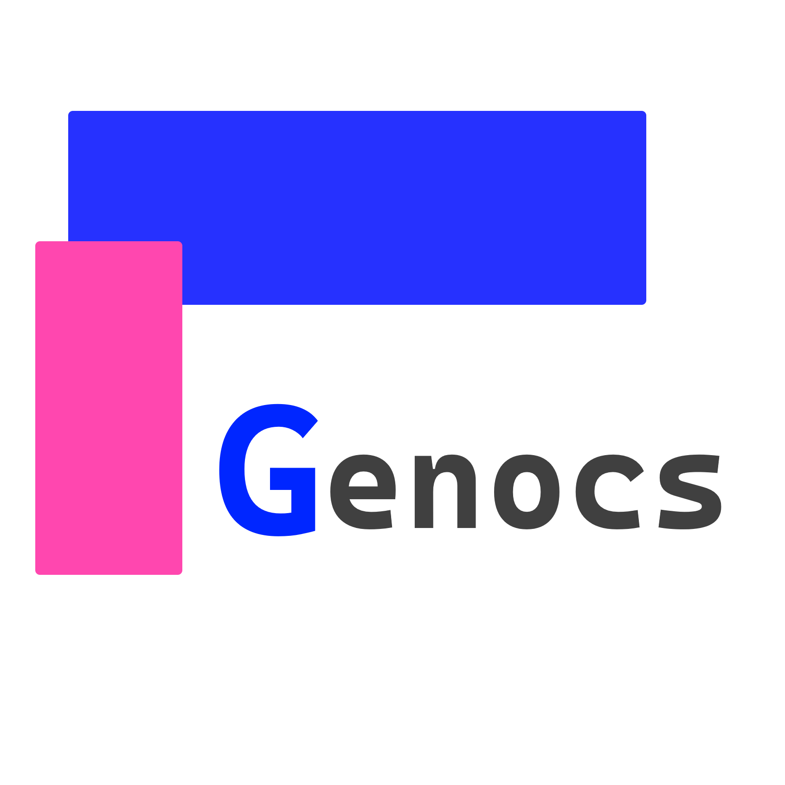

[](https://github.com/Genocs/blazor-template/blob/main/LICENSE)
[](https://discord.com/invite/fWwArnkV))
[](https://twitter.com/genocs)
[](https://github.com/Genocs/blazor-template/actions/workflows/dotnet.yml)

<p align="center">
    
</p>

# Blazor WebAssembly Template 
Built with .NET 6.0 and MudBlazor Component Library. Incorporates the most essential Packages your projects will ever need. Follows Clean Architecture Principles.

## Goals

The goal of this repository is to help developers / companies kickstart their Web Application Development with a pre-built Blazor WebAssembly Boilerplate that includes several much needed components and features.

> Note that this is a frontend / client application only! The backend for this application is available in a seperate repository. 
> - Find Genocs's .NET Web API template here - https://github.com/Genocs/dotnet-webapi-template

## Prerequisites

- Make sure you have the API Running. Here is Genocs Backend - https://github.com/Genocs/dotnet-webapi-template
- Once Genocs's .NET Web API is up and running, run the Blazor WebAssembly Project to consume it's services.

## Getting Started

Open up your Command Prompt / Powershell and run the following command to install the solution template.

``` PS
dotnet new --install Genocs.BlazorTemplate
```

or, if you want to use a specific version of the boilerplate, use

```powershell
dotnet new --install Genocs.BlazorTemplate::0.0.1-rc
```
This would install the `Genocs Blazor WebAssembly Template` globally on your machine. Do note that, at the time of writing this documentation, the latest available version is **0.0.1** which is also one of the first stable release version of the package. It is highly likely that there is already a newer version available when you are reading this.

> *To get the latest version of the package, visit [nuget.org](https://www.nuget.org/packages/Genocs.BlazorTemplate/)*
>
> *Genocs.BlazorTemplate is now in pre-release state. You can find the latest version on NuGet.org*

**Genocs.BlazorTemplate::0.0.1-rc is compatible only with FullStackHero.WebAPI.Boilerplate::0.0.6-rc and above.**

Get the .NET WebApi Boilerplate by running the following command

```
dotnet new --install FullStackHero.WebAPI.Boilerplate::0.0.6-rc
```

For more details on getting started, [read this article](https://genocs-blog.netlify.app/blazor-template/general/overview//)

## Community

- Discord [@genocs](https://discord.com/invite/fWwArnkV))
- Facebook Page [@cgenocs](https://facebook.com/Genocs)
- Youtube Channel [@genocs](https://youtube.com/c/genocs)

## Contributors

Submit your PR and join the list!

<a href="https://github.com/Genocs/blazor-template/graphs/contributors">
  
</a>

## License

This project is licensed with the [MIT license](LICENSE).

## Support :star:

Has this Project helped you learn something New? or Helped you at work?
Here are a few ways by which you can support.

-   Leave a star! :star:
-   Recommend this awesome project to your colleagues. 🥇
-   Do consider endorsing me on LinkedIn for ASP.NET Core - [Connect via LinkedIn](https://www.linkedin.com/in/giovanni-emanuele-nocco-b31a5169/) 🦸
-   Or, If you want to support this project in the long run, [consider buying me a coffee](https://www.buymeacoffee.com/genocs)! ☕

<br>
    
<a href="https://www.buymeacoffee.com/genocs"></a>
